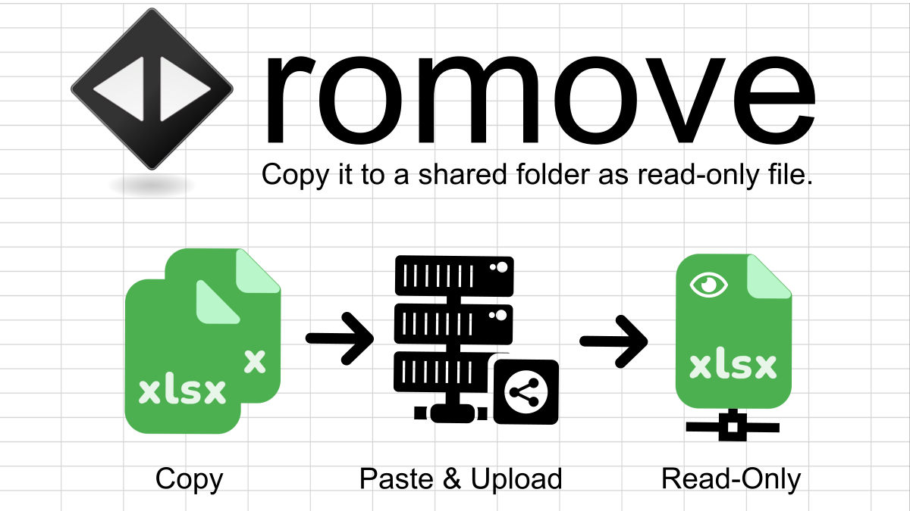

# romove

Copy it to a shared folder as read-only file..  
For more details on romove, please go to [http://pc-chem-basics.blog.jp/archives/28105248.html](http://pc-chem-basics.blog.jp/archives/28105248.html)  

Windons executable can be downloaded on the following link:  
[**romove.zip**](https://github.com/RyokoKuga/romove/releases/download/Version/romove.zip)
